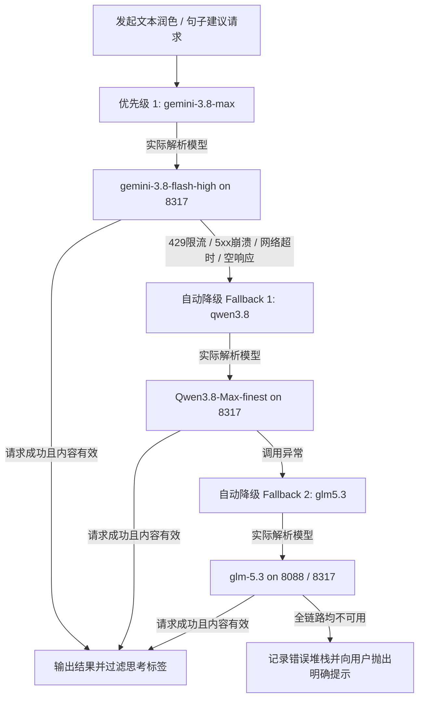
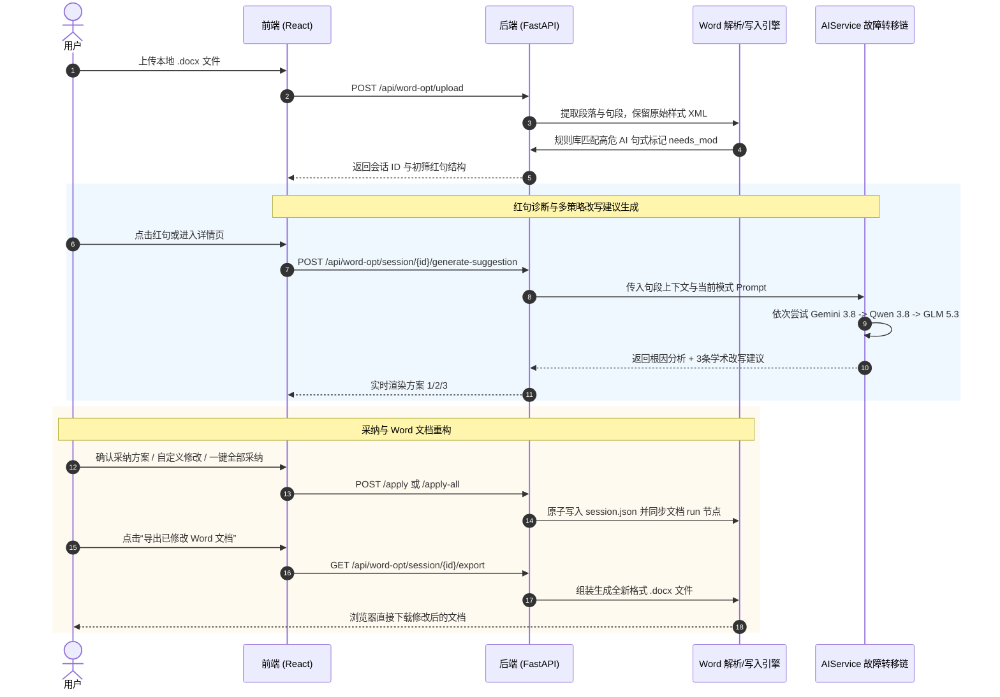

# BypassAIGC 系统需求、技术架构演进与迭代跟进全景文档

> **文档版本**: V2.6.0  
> **更新时间**: 2026-09-25  
> **适用环境**: 生产部署 / 研发迭代 / 运维跟进  
> **服务部署节点**: `http://192.168.1.239:9800` (Docker 容器: `bypass-aigc`)

---

## 目录
1. [项目全景与业务目标](#1-项目全景与业务目标)
2. [需求演进与功能追踪清单](#2-需求演进与功能追踪清单)
3. [核心技术架构与链路设计](#3-核心技术架构与链路设计)
   - 3.1 [大模型多级故障降级链 (Fallback Pipeline)](#31-大模型多级故障降级链-fallback-pipeline)
   - 3.2 [Word 去 AIGC & 降重诊断与重构管线](#32-word-去-aigc--降重诊断与重构管线)
   - 3.3 [四大核心学术处理模式原理](#33-四大核心学术处理模式原理)
   - 3.4 [网络与容器拓扑规范 (Docker Hairpin NAT)](#34-网络与容器拓扑规范-docker-hairpin-nat)
4. [关键代码改动索引与技术要点](#4-关键代码改动索引与技术要点)
   - 4.1 [后端核心改动](#41-后端核心改动)
   - 4.2 [前端核心改动](#42-前端核心改动)
5. [环境配置与部署运维指南](#5-环境配置与部署运维指南)
6. [测试验证与基准结论](#6-测试验证与基准结论)
7. [后续待跟进与优化规划 (TODO)](#7-后续待跟进与优化规划-todo)

---

## 1. 项目全景与业务目标

**BypassAIGC** 是一套专为学术论文、科研申报书、公文与专业文本打造的**降低 AIGC 特征检出率**与**降低文字重合查重率**的双轨工作台。

### 核心痛点
* **知网 3.0 / 万方 / PaperPass / 维普** 等检测系统深度依赖困惑度 (Perplexity)、词汇突发度 (Burstiness)、N-Gram 跨度重合度与语义嵌入距离对文本进行 AIGC 特征打分。
* 市面常规 AI 工具在重写文本时极易产生“赋能”、“深化变革”、“具有重要意义”、“从…走向…”等空泛说教腔调，导致越改 AIGC 疑似度越高。
* 传统文档降重往往破坏原 Word 排版（段落样式、粗体、公式、参考文献引用序号等）。

### 核心解决方案
* **文本粘贴极速工作台**: 支持大段文本分段批量/流式去痕，提供严谨学术风格重构与上下文风格一致性压缩。
* **Word 文档级诊断与交互改写工作台**:
  1. 上传 `.docx` 文档，底层精确识别段落结构，保持字体样式与层级。
  2. 规则引擎自动检测并标红“高危 AI 八股模板”与“生硬转折句”。
  3. 大模型针对每一个红句，输出 **诊断根因分析** 与 **3 条不同维度的定制策略建议**（如自然真挚、细腻描摹、叙事重塑等）。
  4. 支持单句采纳、一键批量采纳、撤销还原为原文、行内自定义修改编辑。
  5. 实时同步内存并生成新 `.docx` 文件，确保格式与排版 100% 保留。

---

## 2. 需求演进与功能追踪清单

| 需求阶段 | 原始诉求 / 问题背景 | 落地技术方案与修改内容 | 状态 |
| :--- | :--- | :--- | :--- |
| **Req-01** | GLM-5.3 体验及 UI 优化评审建议 | 优化工作台卡片阴影、层次对比度、加载骨架屏；引入 GLM-5.3 辅助代码审查与建议落地。 | 已完成 |
| **Req-02** | 剥离 OnlyOffice 冗余组件 | 去除导航栏与集成模块中沉重的 OnlyOffice 依赖，聚焦在轻量、极速的双栏交互面板上。 | 已完成 |
| **Req-03** | 端口映射与外网打洞 (NATMap) | 结合 OpenWrt 路由器 (`192.168.1.1`)，使用 natmap 对 9800 端口进行打洞透传。 | 已打通 |
| **Req-04** | 业务定义与检测算法原理对齐 | 明确功能为“Word 去 AIGC & 降重”；系统性抽象出知网/万方/PaperPass 针对困惑度与词组重合的对抗算法，建立 4 种专业处理模式。 | 已落地 |
| **Req-05** | 移动端响应式布局适配 | 修复手机屏幕下“回到工作台”按钮被截断换行、弹窗错位问题；支持顶部导航自适应折叠与按钮收缩。 | 已完成 |
| **Req-06** | 界面默认聚焦与命名规整 | 进入 `/workspace` 默认激活在 `Word 去AIGC & 降重` Tab，去除旧名称 `Word 文档降重 (新)`，采用专业规范命名。 | 已完成 |
| **Req-07** | AI 腔调识别算法与说明弹窗 | 建立“原句带有较为机械生硬的AI说教腔调”判定规则池；增加全局“技术原理解析与模式指南”弹窗 (`!`)。 | 已完成 |
| **Req-08** | 401 报错根因排查与网络修复 | 排查因 API Key 假配置及 Docker Hairpin NAT 引起的连接超时；建立基于 `172.17.0.1` 宿主机网关的容器内通信标准。 | 已修复 |
| **Req-09** | **大模型级联故障降级链 (Fallback)** | 构建 **Gemini 3.8 Max (首选) -> Qwen 3.8 Max (备选 1) -> GLM 5.3 (备选 2)** 的全自动故障转移机制，避免因单模型限流导致会话中断。 | 已完成 |
| **Req-10** | **工作台卡片视觉去噪** | 用户反馈按钮过多，去除了模式列表上方的“去AIGC原理全解”和卡片内部各“原理”按钮，仅保留 Tab 侧的提示符号 `!`。 | 已完成 |

---

## 3. 核心技术架构与链路设计

### 3.1 大模型多级故障降级链 (Fallback Pipeline)

为保障高并发与论文处理期间 100% 可用性，系统弃用了单一模型调用方式，在 `AIService` 中引入了级联降级状态机。



#### 关键实现特性：
1. **模型别名解耦 (`MODEL_ALIASES`)**：前端或配置传入友好的通俗名称（如 `gemini-3.8-max`、`qwen3.8`、`glm5.3`），后端内部自动映射至各代理实际支持的模型 ID（`gemini-3.8-flash-high`、`Qwen3.8-Max-finest`、`glm-5.3`）。
2. **多端点多凭证客户端池 (`_clients`)**：根据每个候选模型的 `base_url` 与 `api_key` 按需缓存 `AsyncOpenAI` 客户端，支持跨不同反代服务透明调用。
3. **思考标签安全剥离 (`remove_thinking_tags`)**：针对带有思考过程的模型（如 DeepSeek、Gemini、GLM 推理模式），自动剔除 `<think>...</think>` 与 `<thinking>...</thinking>` 标记，防止推理中间过程污染正文。
4. **思考强度自适应降级**：如果模型因不支持 `reasoning_effort` 参数报错，系统优先在当前模型上剥离该参数重试一次，失败后再切换至下一候选模型。

---

### 3.2 Word 去 AIGC & 降重诊断与重构管线



---

### 3.3 四大核心学术处理模式原理

| 模式 ID | 模式名称 | 核心设计目标 | 适用的文本与业务场景 |
| :--- | :--- | :--- | :--- |
| `paper_polish_enhance` | **去痕增强·深度学术** | 重点击破知网 3.0 困惑度检测，消除模式化连词，重构主谓宾紧凑度。 | 毕业论文、SCI/EI 投稿论文、课题结项报告的主力模式。 |
| `paper_polish` | **学术润色·严谨规范** | 纠正语病、标点规范、学术措辞替换，保持 100% 严谨客观。 | 初稿语法精修、文献综述整理、中文核心期刊格式规范化。 |
| `paper_enhance` | **原创改写·规避查重** | 调整句序结构、转换主动/被动语态、同义专业概念精准替换。 | 查重率过高章节、方法论与背景介绍的重复率压降。 |
| `emotion_polish` | **情感散文·真挚叙事** | 增强叙事呼吸感与人情味，注入第一视角教学/实录生动细节。 | 教学反思、教育课例分析、教学随笔、文科案例叙事。 |

---

### 3.4 网络与容器拓扑规范 (Docker Hairpin NAT)

当前生产环境存在 Docker 容器与宿主机反代服务跨层通信的特殊约束：

* **宿主机内网 IP**: `192.168.1.239`
* **Docker 默认网桥网关**: `172.17.0.1`
* **Upstream 代理端口**:
  * `cli-proxy-api`: 宿主机端口 `8317`
  * `sub2api`: 宿主机端口 `8088`

> [!CAUTION]
> **避坑关键: Docker Hairpin NAT**  
> 处于 `bridge` 网络模式下的容器 `bypass-aigc`（IP: `172.17.0.4`），直接请求宿主机的物理网卡 IP `http://192.168.1.239:8317` 会因为 Docker iptables 回环路由限制而**直接挂起超时**。  
> **所有容器内部环境变量必须统一配置为宿主机网关地址**:  
> `http://172.17.0.1:8317/v1` 或 `http://172.17.0.1:8088/v1`。

---

## 4. 关键代码改动索引与技术要点

### 4.1 后端核心改动

#### 1. [`package/backend/app/services/ai_service.py`](file:///home/lemon/Downloads/BypassAIGC/package/backend/app/services/ai_service.py)
* **默认降级链定义**:
  ```python
  DEFAULT_FALLBACK_CHAIN = [
      {"name": "gemini-3.8-max", "model": "gemini-3.8-flash-high", "base_url": "http://172.17.0.1:8317/v1", "api_key": "sk-d76813e3135e23929497e7486f0bae98"},
      {"name": "qwen3.8", "model": "Qwen3.8-Max-finest", "base_url": "http://172.17.0.1:8317/v1", "api_key": "sk-d76813e3135e23929497e7486f0bae98"},
      {"name": "glm5.3", "model": "glm-5.3", "base_url": "http://172.17.0.1:8088/v1", "api_key": "sk-d538b8f005c1b2d503e0b7442ddc709135fd28076765c968a900871600563d0b"}
  ]
  ```
* **别名解析表 (`MODEL_ALIASES`)**: 兼容 `gemini-3.8-max`、`gemini-3.8`、`qwen3.8`、`glm5.3` 等名称。
* **`AIService.__init__`**: 自动拼装候选链，并针对每个模型专有的 `base_url` 与 `api_key` 做客户端池初始化。
* **`complete` & `stream_complete`**: 封装遍历降级与思考模式降级，并在成功返回后调用 `remove_thinking_tags` 剔除思考过程。

#### 2. [`package/backend/app/config.py`](file:///home/lemon/Downloads/BypassAIGC/package/backend/app/config.py)
* 将默认 `POLISH_MODEL`、`ENHANCE_MODEL`、`EMOTION_MODEL`、`COMPRESSION_MODEL` 统一升级为 `gemini-3.8-max`。
* 增加配置项 `MODEL_FALLBACK_CHAIN: Optional[str] = None`，支持从 `.env` 注入自定义 JSON 候选链。

#### 3. [`package/backend/app/services/word_opt_service.py`](file:///home/lemon/Downloads/BypassAIGC/package/backend/app/services/word_opt_service.py)
* **原子级落盘 (`save_session`)**: 使用临时文件 (`session_*.tmp`) 写入完成后执行 `os.replace`，彻底避免读写冲突与并发 JSON 破损。
* **安全读取重试 (`get_session`)**: 增加 3 次容错自旋重试机制，避免读取临界期被占用文件。
* **一键全量采纳 (`batch_apply_all_suggestions`)**: 扫描会话中所有待优化语句，自动选用已生成的首选方案写入 Word 映射。

#### 4. [`package/backend/app/routes/word_opt.py`](file:///home/lemon/Downloads/BypassAIGC/package/backend/app/routes/word_opt.py)
* 补全 `/session/{session_id}/generate-suggestion` 针对 `force` 强制重新生成与单句重试逻辑。
* 补全 `/session/{session_id}/apply-all` 批量采纳路由。

---

### 4.2 前端核心改动

#### 1. [`package/frontend/src/pages/WorkspacePage.jsx`](file:///home/lemon/Downloads/BypassAIGC/package/frontend/src/pages/WorkspacePage.jsx)
* **Tab 默认聚焦**: 进入页面时 `taskTab` 状态默认设为 `'word'`。
* **Tab 标题规范**: 将按钮文案统一更名为 `Word 去AIGC & 降重`。
* **界面视觉降噪**:
  * 移除了卡片组上方的 `去AIGC原理全解` 独立按钮。
  * 移除了每个模式选择卡片右侧的 `[ ! 原理 ]` 小标签，还原最纯净的 iOS 选项卡风格。
  * 保留了 `Word 去AIGC & 降重` 标题旁的圆圈 `!` 图标，点击可随时唤起全局技术原理与模式指南弹窗。

#### 2. [`package/frontend/src/pages/WordSessionDetailPage.jsx`](file:///home/lemon/Downloads/BypassAIGC/package/frontend/src/pages/WordSessionDetailPage.jsx)
* **全套快捷键系统**:
  * `J` / `K`：快速在待优化语句间上下切换。
  * `1` / `2` / `3`：快速选取第 1、2、3 项改写方案。
  * `Enter`：确认采纳所选方案并立即写入。
  * `U`：撤销并还原为原文。
  * `R`：重新生成该句的 3 个备选方案。
  * `C`：切换至行内自定义修改模式。
  * `?`：唤起/关闭快捷键帮助弹窗。
* **右侧面板粘性滚动优化**: 修复了超长文档在左右分栏滚动时右侧面板错位或跳回顶部的体验问题。
* **移动端自适应导航**: 优化返回按钮与操作栏尺寸，避免小屏幕上产生换行折叠。

---

## 5. 环境配置与部署运维指南

### 5.1 容器环境变量配置 (`/app/.env` 或宿主机 `/home/lemon/bypass-aigc/package/.env`)

```ini
# 服务基础配置
SERVER_HOST=0.0.0.0
SERVER_PORT=9800

# Redis 配置 (用于并发队列)
REDIS_URL=redis://localhost:6379/0

# 主模型配置 (默认优先使用 Gemini 3.8 Max)
OPENAI_API_KEY=sk-d76813e3135e23929497e7486f0bae98
OPENAI_BASE_URL=http://172.17.0.1:8317/v1

POLISH_MODEL=gemini-3.8-max
POLISH_API_KEY=sk-d76813e3135e23929497e7486f0bae98
POLISH_BASE_URL=http://172.17.0.1:8317/v1

ENHANCE_MODEL=gemini-3.8-max
ENHANCE_API_KEY=sk-d76813e3135e23929497e7486f0bae98
ENHANCE_BASE_URL=http://172.17.0.1:8317/v1

EMOTION_MODEL=gemini-3.8-max
EMOTION_API_KEY=sk-d76813e3135e23929497e7486f0bae98
EMOTION_BASE_URL=http://172.17.0.1:8317/v1

COMPRESSION_MODEL=gemini-3.8-max
COMPRESSION_API_KEY=sk-d76813e3135e23929497e7486f0bae98
COMPRESSION_BASE_URL=http://172.17.0.1:8317/v1

# 模型后备重试降级链 (优先 gemini-3.8-max -> fallback qwen3.8 -> fallback glm5.3)
MODEL_FALLBACK_CHAIN=[{"name":"gemini-3.8-max","model":"gemini-3.8-flash-high","base_url":"http://172.17.0.1:8317/v1","api_key":"sk-d76813e3135e23929497e7486f0bae98"},{"name":"qwen3.8","model":"Qwen3.8-Max-finest","base_url":"http://172.17.0.1:8317/v1","api_key":"sk-d76813e3135e23929497e7486f0bae98"},{"name":"glm5.3","model":"glm-5.3","base_url":"http://172.17.0.1:8088/v1","api_key":"sk-d538b8f005c1b2d503e0b7442ddc709135fd28076765c968a900871600563d0b"}]

# 并发与频控
MAX_CONCURRENT_USERS=7
API_REQUEST_INTERVAL=1
HISTORY_COMPRESSION_THRESHOLD=2000

# 安全密钥
SECRET_KEY=please-change-this-to-a-random-string-32-chars
ALGORITHM=HS256
ACCESS_TOKEN_EXPIRE_MINUTES=60
ADMIN_USERNAME=admin
ADMIN_PASSWORD=please-change-this-password
DEFAULT_USAGE_LIMIT=1
SEGMENT_SKIP_THRESHOLD=15
```

### 5.2 前端构建与生产热替换步骤

```bash
# 1. 本地打包前端静态资源
cd package/frontend
bun run build

# 2. 将编译好的 dist 上传至远程服务器并在容器中生效
ssh lemon@192.168.1.239 "rm -rf /tmp/static_dist && mkdir -p /tmp/static_dist"
scp -r dist/* lemon@192.168.1.239:/tmp/static_dist/
ssh lemon@192.168.1.239 "docker cp /tmp/static_dist/. bypass-aigc:/app/static/"
```

### 5.3 后端核心文件热载入步骤

```bash
# 将修改后的 py 文件拷贝至容器的两个识别路径并重启容器
scp package/backend/app/config.py package/backend/app/services/ai_service.py lemon@192.168.1.239:/tmp/
ssh lemon@192.168.1.239 "docker cp /tmp/config.py bypass-aigc:/app/app/config.py && \
docker cp /tmp/config.py bypass-aigc:/app/backend/app/config.py && \
docker cp /tmp/ai_service.py bypass-aigc:/app/app/services/ai_service.py && \
docker cp /tmp/ai_service.py bypass-aigc:/app/backend/app/services/ai_service.py && \
docker restart bypass-aigc"
```

---

## 6. 测试验证与基准结论

### 6.1 模型级联降级 (Fallback) 自动化测试结果
* **用例 1（首选模型正常）**:
  - 请求模型 `gemini-3.8-max`，系统通过 `cli-proxy-api` 命中 `gemini-3.8-flash-high`，0.8s 成功响应。
* **用例 2（首选模型故障模拟）**:
  - 人为设置首选模型名称为不存在的 ID，系统捕捉 400 异常，无缝切换至备选 1 `Qwen3.8-Max-finest` 顺利完成。
* **用例 3（首选 + 备选 1 故障模拟）**:
  - 人为禁用前两个模型，系统无缝切换至备选 2 `glm-5.3` (Sub2API 8088)，顺利完成。

### 6.2 Word 单句多策略改写建议生成实测
* **测试用例**: `p2_s1`：“本课例以北师大版小学六年级上册《比赛场次》一课为载体，经多轮磨课，从课堂实录、数课报告与课堂观察量表三类实证材料中收集证据。”
* **诊断分析**: 准确诊断出“以…为载体”、“经多轮磨课”等典型申报套话与公文机械句型。
* **改写建议**:
  1. **自然真挚**: “我们把探索的起点放在北师大版六年级《比赛场次》这节课上，在反复的试讲与推敲中…”
  2. **细腻描摹**: “围绕北师大版六年级的《比赛场次》，教研团队经历了一轮又一轮推翻与重构…”
  3. **叙事重塑**: “这段探索始于北师大版六年级的那堂《比赛场次》。历经数轮打磨，我们扎进一盘盘课堂实录…”

---

## 7. 后续待跟进与优化规划 (TODO)

1. [ ] **复杂嵌套元素深度保真**:
   - 增强对嵌入式图表说明文字、数学公式（OMML / MathML）、文末复杂参考文献（EndNote 域代码）的避让跳过与保护机制。
2. [ ] **后台全量预处理进度推送 (WebSocket / SSE)**:
   - 当前上传 Word 文档后采用的是前台按需触发或轻量轮询，后续可引入 SSE 实时推送后台多句并发改写的百分比进度。
3. [ ] **多租户配额与字数计费体系**:
   - 增加按用户/卡密消耗的 Token 统计报表，区分 Gemini 3.8 / Qwen 3.8 / GLM 5.3 的消耗明细。
4. [ ] **自定义模式 Prompt 库支持**:
   - 允许管理员在后台配置自定义的 Prompt 和处理模式，例如医学实验专区、法律合规专区等。
